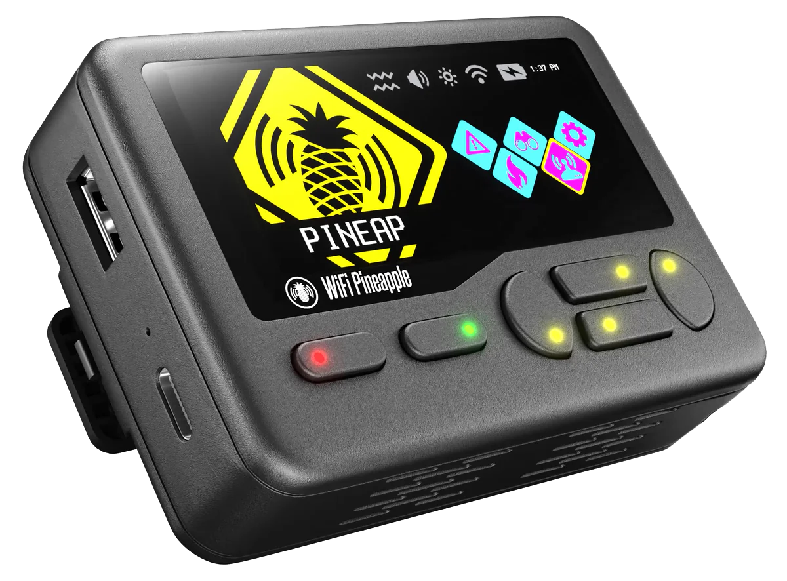
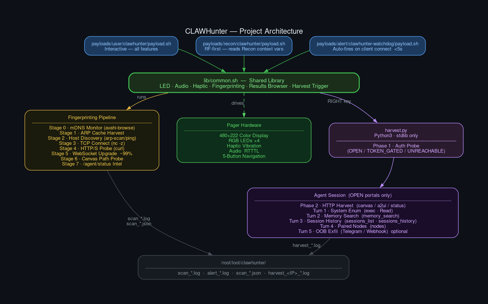

# ✦ CLAWHunter



A [Hak5 WiFi Pineapple Pager](https://docs.hak5.org/wifi-pineapple-pager/) payload **suite** for discovering and exploiting [OpenClaw](https://docs.openclaw.ai) AI gateway instances on local networks. Three payload variants — interactive, recon-triggered, and alert-fired — share a common fingerprinting library with full hardware integration: color display, RGB LEDs, haptic feedback, audio cues, interactive results browser, and an integrated post-exploitation harvest engine.


---



---

## Contents

1. [Repository structure](#repository-structure)
2. [Prerequisites & deploy](#prerequisites--deploy)
3. [Payload variants](#payload-variants)
4. [Usage — User payload](#usage--user-payload)
5. [Scan speed profiles](#scan-speed-profiles)
6. [Controls](#controls)
7. [OpenClaw fingerprinting pipeline](#openclaw-fingerprinting-pipeline)
8. [Harvest module](#harvest-module)
9. [Hardware features](#hardware-features)
10. [Display behavior](#display-behavior)
11. [LED states](#led-states)
12. [Port reference](#port-reference)
13. [External tools & fallbacks](#external-tools--fallbacks)
14. [Log & report output](#log--report-output)
15. [Troubleshooting](#troubleshooting)
16. [Version history](#version-history)

---

## Repository structure

```
CLAWHunter/
├── docs/
│   ├── V3-RESEARCH.md                ← Protocol research, feature specs, stretch goals
│   ├── architecture.dot              ← Graphviz source for architecture diagram
│   └── architecture.svg              ← Architecture diagram (vector)
├── images/
│   ├── architecture.png              ← Architecture diagram (rendered)
│   └── pager-transparent.png         ← Pager hero image
├── lib/
│   └── common.sh                     ← Shared library (LED, audio, fingerprinting, harvest trigger)
├── payloads/
│   ├── user/clawhunter/
│   │   ├── payload.sh                ← Interactive payload (all features)
│   │   └── harvest.py                ← Post-exploitation harvest engine (Python3, stdlib-only)
│   ├── recon/clawhunter/
│   │   └── payload.sh                ← Recon variant (RF-first, auto-connect)
│   └── alert/clawhunter-watchdog/
│       └── payload.sh                ← Alert variant (auto-fires, <5s, silent)
├── CHANGELOG.md                      ← Full version history with dates
└── CONTRIBUTING.md                   ← Contribution guidelines and compatibility rules
```

---

## Prerequisites & deploy

### Hardware requirements

- Hak5 WiFi Pineapple Pager (4 GB internal eMMC — no microSD required)

### Optional packages (install via SSH on the Pager)

> The `-d mmc` flag installs to the Pager's internal 4 GB eMMC partition (where `/root`, payloads, and loot live), not a microSD card. The root overlay has <32 MB free after firmware — always use `-d mmc` for larger packages like python3.

```bash
opkg update
opkg install -d mmc avahi-utils   # mDNS discovery (Stage 0)
opkg install -d mmc arp-scan      # faster Layer-2 host discovery
opkg install -d mmc python3       # required for harvest module
```

### Deploy all at once (recommended)

```bash
# Create directories on the Pager:
ssh root@pineapple.lan "mkdir -p \
    /root/payloads/lib \
    /root/payloads/user/clawhunter \
    /root/payloads/recon/clawhunter \
    /root/payloads/alert/clawhunter-watchdog"

# Copy shared library:
scp lib/common.sh \
    root@pineapple.lan:/root/payloads/lib/common.sh

# Copy user payload + harvest engine:
scp payloads/user/clawhunter/payload.sh \
    payloads/user/clawhunter/harvest.py \
    root@pineapple.lan:/root/payloads/user/clawhunter/

# Copy recon and alert payloads:
scp payloads/recon/clawhunter/payload.sh \
    root@pineapple.lan:/root/payloads/recon/clawhunter/
scp payloads/alert/clawhunter-watchdog/payload.sh \
    root@pineapple.lan:/root/payloads/alert/clawhunter-watchdog/
```

Or with rsync (preserves structure automatically):

```bash
rsync -av lib/ root@pineapple.lan:/root/payloads/lib/
rsync -av payloads/ root@pineapple.lan:/root/payloads/
```

### Expected layout on Pager after deploy

```
/root/payloads/
├── lib/
│   └── common.sh
├── user/clawhunter/
│   ├── payload.sh
│   └── harvest.py          ← required for harvest module
├── recon/clawhunter/
│   └── payload.sh
└── alert/clawhunter-watchdog/
    └── payload.sh
```

### OOB exfil configuration (optional — configure before deploy)

If using the out-of-band exfil feature, uncomment and fill in the constants near the top of `payloads/user/clawhunter/payload.sh` **before** copying to the Pager:

```bash
# ── Out-of-band exfil config (optional — fill in before deploying) ──────────
# EXFIL_BOT_TOKEN=""   # Telegram bot token (from @BotFather)
# EXFIL_CHAT_ID=""     # Telegram chat_id to receive exfil data
# EXFIL_WEBHOOK_URL="" # Alternative: HTTPS webhook URL
```

> DuckyScript has no free-text input primitive, so credentials cannot be entered interactively. All config must be set before deployment.

---

## Payload variants

### User payload — `payloads/user/clawhunter/`

Full interactive experience. Launched from **Payloads → user → clawhunter** in the Pager UI. Includes all v2.1.0 and v3.x features: upfront option pickers, continuous mDNS monitor, ARP cache harvest, scan speed profiles, MAC randomization, interactive results browser, cross-run history/diff, watchdog mode, and the integrated harvest engine.

**Primary payload for manual field ops.**

### Recon payload — `payloads/recon/clawhunter/`

RF-first workflow. Launched from the **Recon UI** after selecting a target AP. Reads `_RECON_SELECTED_AP_SSID`, `_RECON_SELECTED_AP_ENCRYPTION_TYPE`, and `_RECON_SELECTED_AP_BSSID` context variables automatically — no manual subnet or port pickers needed.

**Flow:** Recon UI selects AP → payload reads AP context → pre-saved credential notice (if WPA) → connect → mDNS prescan → ARP discovery → port sweep → results browser → disconnect

### Alert payload — `payloads/alert/clawhunter-watchdog/`

Zero-interaction auto-trigger. Fires whenever a client connects to the Pager's AP. Probes the connecting client's IP directly — no subnet sweep. Completes in <5 seconds. Silent forced. Vibrates on confirmed finds. Logs to `/root/loot/clawhunter/alert_YYYYMMDD_HHMMSS.log`.

---

## Usage — User payload

Launch from **Payloads → user → clawhunter** in the Pager UI.

### Upfront prompts (before scan)

| Prompt | Default | Description |
|--------|---------|-------------|
| View scan history? | No | Browse past finds across all scan logs (only shown if prior logs exist) |
| Silent mode? | No | Suppress all audio and vibration |
| Randomize MAC? | No | Randomize scanner MAC before scan, restore on exit via cleanup trap |
| Scan profile | NORMAL | GHOST / QUIET / NORMAL / FAST / AGGRESSIVE |
| Connect to AP first? | No | WiFi client mode — requires Recon UI AP selection or pre-saved credentials |
| Target subnet | Auto-detected | First three octets (e.g. `192.168.4`) |
| OpenClaw port | `18790` | Primary target port |
| Advanced options? | No | Gate for port range / extended ports / randomize order |
| → Wide port range? | No | Sweep `18780–18800` instead of single port |
| → Extended ports? | No | Also probe 80, 443, 3000, 8080, 8443 |
| → Randomize order? | No | Shuffle host list (awk PRNG — busybox compatible) |
| Full /24 scan? | Yes | 254 hosts (~90s NORMAL) or quick `.1–.50` (~20s) |
| mDNS dwell (sec) | 30 | Continuous mDNS monitor duration *(only shown if `avahi-browse` installed)* |

### Post-scan prompts (after scan completes with finds)

| Prompt | Default | Description |
|--------|---------|-------------|
| Watchdog mode? | No | Periodic rescan; alerts only on new/gone instances *(only offered if ≥1 found)* |
| → Rescan interval (min) | 5 | Minutes between watchdog rescans |

### WiFi client mode — note on password entry

DuckyScript has no free-text input primitive, so SSID and password cannot be entered interactively at runtime.

- **SSID:** Launch from the **Recon UI** with a target AP selected — the payload reads `_RECON_SELECTED_AP_SSID` automatically.
- **Password:** Pre-save the AP credentials via the Pager's WiFi Settings before running. The payload connects using saved credentials. If credentials are not saved and the AP is encrypted, a notice is shown and the connection is attempted anyway (may fail).

---

## Scan speed profiles

| Profile | Behavior | Dither (base + jitter) | Notes |
|---------|----------|----------------------|-------|
| **GHOST** | Passive only — mDNS monitor + ARP cache harvest, no port probes | none | Zero active traffic |
| **QUIET** | Sequential probes, 50ms floor, silent mode forced | 50ms + 0–200ms | Mimics human-paced browsing |
| **NORMAL** | Sequential probes, default behavior | 0ms + 0–80ms | Breaks metronomic timing |
| **FAST** | Parallel probes (3 hosts at a time) | 0ms + 0–25ms | ~3× throughput |
| **AGGRESSIVE** | All ports + extended, 5 parallel probes | none | Speed priority; IDS risk accepted |

Dither applies `$RANDOM % (jitter+1)` — bash builtin, no external tools. Combines with randomized host order for two-axis IDS evasion: *what* is scanned is shuffled, *when* each probe fires is dithered.

---

## Controls

| Button | Context | Action |
|--------|---------|--------|
| UP / DOWN | Pickers | Adjust value |
| UP / DOWN | Profile selector | Change profile |
| B | Profile selector | Confirm selection |
| B | Any picker | Cancel / use default |
| B | During scan | Abort scan cleanly |
| B | mDNS countdown | Skip mDNS monitor, proceed to scan |
| UP / DOWN | Results browser | Navigate found hosts |
| RIGHT *(or any key ≠ UP/DOWN/B/LEFT)* | Results browser | Launch harvest against current find |
| B or LEFT | Results browser | Exit results browser |
| UP / DOWN | History browser | Navigate past finds |
| B or LEFT | History browser | Exit history browser |
| B | Watchdog countdown | Exit watchdog mode |
| Any | ALERT popup | Dismiss and continue |
| Any | Final PROMPT | Exit payload |

---

## OpenClaw fingerprinting pipeline

Detection runs in stages per host:port. Each stage gates the next.

### Stage 0 — mDNS monitor
Continuous `avahi-browse -a -r -p` for the configured dwell (default 30s). Countdown shown on display. LED pulses cyan. Any record matching `openclaw` or `clawd` = confirmed find, added before port sweep. Requires `avahi-browse` (`opkg install -d mmc avahi-utils`).

### Stage 1 — ARP cache harvest
Before active discovery, checks `/proc/net/arp` and `ip neigh show`. Known hosts skip ARP scanning entirely, speeding up the discovery phase.

### Stage 2 — Host discovery
`arp-scan` → `arping` → `ping` fallback. Builds the live-host list for the sweep. Falls back gracefully if `arp-scan` or `arping` are not installed.

### Stage 3 — TCP connect
`nc -z -w 1` fast closed-port filter. Skips curl probe on closed ports.

### Stage 4 — HTTP/HTTPS probe
`curl` with 3s timeout. Tries `http://` then `https://` per port. **Confirmed** if: body contains `openclaw`, `clawd`, or `gateway` keyword, OR HTTP 400/401/403 on the primary target port. **Candidate** if: any HTTP response on extended ports.

### Stage 5 — WebSocket upgrade probe
Raw WS upgrade handshake via `/dev/tcp` with `nc` fallback:

```
GET / HTTP/1.1
Upgrade: websocket
Sec-WebSocket-Key: dGhlIHNhbXBsZSBub25jZQ==
Sec-WebSocket-Version: 13
```

A valid OpenClaw gateway accepts the WS upgrade (HTTP 101) before requiring auth. Any other HTTP server either fails the upgrade or returns a non-101 response. Detection confidence: **~99%**.

### Stage 6 — Canvas path probe
`GET /__openclaw__/canvas/` and `GET /__openclaw__/a2ui/`. These URL paths are unique to OpenClaw. Any non-404 response is near-certain confirmation, even without auth.

### Stage 7 — `/agent/status` intel
`GET /agent/status?session=agent:main:main`. If live, extracts and displays:
- Model in use (e.g. `anthropic/claude-opus-4-6`)
- Context usage percentage
- Active tool calls count
- Sub-agent count
- Gateway uptime timestamp

---

## Harvest module

The integrated post-exploitation engine. Triggered from the **Results Browser** — no separate tool or shell access required.

### Requirements

- **python3** on the Pager: `opkg install -d mmc python3`
- **harvest.py** deployed at `/root/payloads/user/clawhunter/harvest.py`
- `harvest.py` uses Python3 stdlib only — no pip, no third-party packages required

### How to trigger

1. Run the user payload until a confirmed OpenClaw instance appears in the Results Browser
2. Navigate to the target with **UP/DOWN**
3. Press **RIGHT** (or any key other than UP/DOWN/B/LEFT)
4. Respond to the **"Out-of-band exfil?"** and **"Exfil method?"** prompts
5. Harvest runs — spinner active — completes with ALERT on success

Results Browser display:

```
  Find 1/1                        ← green
    192.168.4.100                 ← green
    port: 18790                   ← blue
    http:// | HTTP 401 | ...
    UP/DOWN=nav  B=done  >=harvest
```

### Three-phase harvest

| Phase | Name | Auth required | What it collects |
|-------|------|--------------|-----------------|
| 1 | Auth probe | None | Classifies target: OPEN / TOKEN_GATED / UNREACHABLE |
| 2 | HTTP harvest | None | `/__openclaw__/canvas/`, `/__openclaw__/a2ui/`, `/agent/status`, `/` — status codes, headers, body content |
| 3 | Multi-turn agent session | **Open portal only** | 4–5 sequential turns using the agent's native tools |

### Agent session turns (OPEN portals only)

| Turn | Label | Agent tools used | Per-turn timeout |
|------|-------|-----------------|-----------------|
| 1 | System enumeration | `exec` (uname, id, env, ps, ls, find, grep), `Read` (openclaw.json, secrets.json, .env, MEMORY.md, USER.md, TOOLS.md) | 60s |
| 2 | Memory semantic search | `memory_search` — 16 credential/secret keywords | 30s |
| 3 | Session history | `sessions_list`, `sessions_history` (last 20 msgs × 5 sessions) | 30s |
| 4 | Paired nodes | `nodes` action=status, action=describe | 20s |
| 5 | OOB exfil *(optional)* | `exec` — curl POST to Telegram bot API or webhook URL | 20s |

**Turn 1** collects: system identity (`uname -a`, `id`, `hostname`, `uptime`), network config (`ip addr`, `ip route`), running processes (`ps aux`), environment (`env | sort` — includes injected API keys), directory listings, `~/.openclaw/openclaw.json`, `~/.openclaw/secrets.json`, SSH keys, and agent persona/knowledge files.

**Turn 2** sweeps the agent's memory index for 16 keywords: `api_key`, `password`, `token`, `secret`, `credential`, `ssh`, `telegram`, `discord`, `webhook`, `database`, `postgres`, `mysql`, `redis`, `aws`, `openai`, `anthropic`. Returns matched snippets with source file paths and line numbers.

**Turn 3** enumerates all agent sessions via `sessions_list`, then pulls the last 20 messages from each of the 5 most recent sessions — returning full conversation content across all channels.

**Turn 4** enumerates every device paired to the gateway via `nodes action=status` and `action=describe` — phones, tablets, cameras — with names, types, capabilities, and last-seen timestamps.

**Turn 5 (optional)** uses `exec` to `curl` the harvested summary from the victim system directly to the attacker's Telegram bot or webhook. Data flows victim → attacker endpoint independently of the Pager.

### Token-gated portals

If the target requires a bearer token, only Phases 1 and 2 run. No agent session is attempted. The HTTP harvest still yields canvas content, a2ui content, agent status JSON (if reachable), and response headers.

### Exit codes

| Code | Meaning |
|------|---------|
| 0 | Harvest complete — agent session data collected |
| 1 | Token-gated — HTTP harvest only, no agent access |
| 2 | Unreachable — target went offline |
| 3 | Unexpected error (check log for details) |

---

## Hardware features

| Hardware | Usage |
|----------|-------|
| **480×222 px 16-bit color display** | Color-coded LOG output, interactive pickers, profile selector, ALERT popups, results browser, history browser, mDNS countdown, watchdog countdown |
| **RGB LED array (4 LEDs)** | Blue = scanning, fast green = confirmed, alternating = candidate, cyan = mDNS/passive, white = WiFi connecting, magenta = watchdog sleeping, red = error |
| **Haptic (vibration)** | Soft (150ms) on candidate, medium (300ms) on mDNS/WiFi, strong (500ms) on confirmed find, harvest complete, and scan complete; alert variant uses vibrate-only (SILENT forced) |
| **Audio (RINGTONE / RTTTL)** | Startup, find, mDNS find, candidate ping, complete ok/none, abort, WiFi connected, watchdog alert — all suppressed in silent mode |
| **5-button navigation** | UP/DOWN for pickers and profile selection; B to abort scan, exit browsers, exit watchdog; RIGHT to trigger harvest from results browser |

---

## Display behavior

**During scan:**

```
  ✦ CLAWHunter v3.1.0       ← blue header
  OpenClaw Discovery Suite
  mDNS monitoring (30s)...   ← cyan
  mDNS: 25s remaining...
  Checking ARP cache...      ← blue
  Cache: 3 host(s) pre-known
  Discovering hosts...       ← blue
  Live hosts: 47
  12% — 192.168.4.6 (6/47)   ← blue (progress)
  ? Open: 192.168.4.50:18790  ← blue (candidate)
  ✦ FOUND: 192.168.4.100:18790 (http)        ← green
    HTTP 401 — token-gated gateway
    Model: claude-opus-4-6 | Ctx: 44%        ← /agent/status intel
```

**Profile selector:**

```
  Profile: NORMAL            ← green
    Sequential probes, default behavior
    UP/DOWN=change  B=confirm
```

**Results browser:**

```
  Find 1/1                   ← green
    192.168.4.100            ← green
    port: 18790              ← blue
    http:// | HTTP 401 | Model: claude-opus-4-6
    UP/DOWN=nav  B=done  >=harvest
```

**Watchdog sleeping:**

```
  Watchdog: next scan in 240s  ← magenta LED pulsing
  B to exit watchdog
```

---

## LED states

| State | Pattern | Color |
|-------|---------|-------|
| Scanning / probing | Slow pulse 600ms/400ms | Blue |
| Passive mDNS monitor | Slow pulse 800ms/600ms | Cyan |
| Candidate port open | Alternating 250ms | Blue ↔ Green |
| mDNS confirmed find | Double-flash, LEDs 1+2 | Cyan |
| Confirmed OpenClaw | Fast flash 120ms | Green |
| WiFi connecting | Slow pulse 500ms/300ms | White |
| Watchdog sleeping | Slow pulse 1000ms/800ms | Magenta |
| Error / abort | Solid 5s | Red |
| Scan complete — found | Slow pulse 700ms/500ms | Green |
| Scan complete — none | Slow pulse 700ms/500ms | Blue |
| Exiting / off | Off | — |

---

## Port reference

| Port | Description |
|------|-------------|
| `18790` | OpenClaw agent/gateway default (primary scan target) |
| `18789` | OpenClaw control-plane WebSocket (probed on confirmed HTTP finds via Stage 5 WS upgrade) |
| `18780–18800` | Wide port range (non-default and custom configs) |
| `80, 443` | Common reverse proxy front-ends |
| `3000, 8080, 8443` | Common dev/alt proxy ports |

> **Note:** OpenClaw binds to `127.0.0.1` (loopback) by default. CLAWHunter finds instances where `gateway.bind` has been changed to a LAN interface, or those running behind a reverse proxy — exactly the configurations that are exposed at network level.

---

## External tools & fallbacks

| Tool | Used for | Default on Pager? | Fallback |
|------|----------|------------------|---------|
| `nc` | TCP probe, WS fallback | ✅ Yes | — |
| `curl` | HTTP fingerprinting | ✅ Yes | — |
| `awk` | Shuffle, field extract | ✅ Yes (busybox) | — |
| `arping` | L2 host discovery | ✅ Usually | ping sweep |
| `arp-scan` | L2 host discovery | ❌ No | arping → ping |
| `avahi-browse` | mDNS discovery | ❌ No | skipped gracefully |
| `macchanger` | MAC randomization | ❌ No | `ip link` method |
| `python3` | Harvest module | ❌ No | `opkg install -d mmc python3` |

---

## Log & report output

### Scan text log

```
/root/loot/clawhunter/scan_YYYYMMDD_HHMMSS.log   ← user + recon payloads
/root/loot/clawhunter/alert_YYYYMMDD_HHMMSS.log  ← alert variant
/root/loot/clawhunter/harvest_<IP>_<YYYYMMDD_HHMMSS>.log  ← harvest module
```

**Sample scan log:**

```
==================================================
  CLAWHunter v3.1.0 — OpenClaw Discovery
  Hak5 WiFi Pineapple Pager
==================================================
Scan ID        : 20260307_143512
Date/Time      : Sat Mar  7 14:35:12 UTC 2026
Scanner IP     : 10.0.0.150
Subnet         : 10.0.0.1-254
Port(s)        : 18790
Wide range     : NO
Extended ports : NO
Randomized     : YES
Silent mode    : NO
Scan profile   : NORMAL
MAC randomized : YES
ARP available  : YES
avahi available: YES
==================================================

── mDNS MONITOR (30s) ──
[MDNS]      10.0.0.100 via mDNS | record: _openclaw._tcp ...

── PORT SCAN ──
[14:35:44] C2: ARP cache harvest: 3 host(s) pre-known
[14:35:46] Probing: 10.0.0.100 (12/47, 25%)
[FOUND]     10.0.0.100:18790 | http | HTTP 401 | token-gated gateway
[14:35:46]   A1: WebSocket upgrade accepted — protocol-layer confirmed
[14:35:46]   A2: canvas path HTTP 200 — OpenClaw-unique path confirmed
[14:35:47]   A3: model=anthropic/claude-opus-4-6 ctx=44.5% tools=2 subagents=1
[14:35:47]   Detail: Version: 2026.3.2 | Persona: assistant | Model: anthropic/claude-opus-4-6 | Ctx: 44.5%

── DIFF vs PREVIOUS SCANS ──
  New instances : 1
  Gone instances: 0

==================================================
SUMMARY
  Hosts scanned  : 47
  OpenClaw found : 1
  Elapsed        : 95s
  Status         : COMPLETE

  DISCOVERED INSTANCES:
    ✦ 10.0.0.100:18790
==================================================
  Log : /root/loot/clawhunter/scan_20260307_143512.log
  JSON: /root/loot/clawhunter/scan_20260307_143512.json
==================================================
```

### JSON report

```json
{
  "scan_id": "20260307_143512",
  "payload_version": "3.1.0",
  "subnet": "10.0.0.1-254",
  "hosts_scanned": 47,
  "elapsed_seconds": 95,
  "timestamp": "2026-03-07T14:37:47Z",
  "instances": [
    {
      "ip": "10.0.0.100",
      "port": "18790",
      "detail": "http:// | HTTP 401 — token-gated gateway | Version: 2026.3.2 | Persona: assistant | Model: anthropic/claude-opus-4-6 | Ctx: 44.5% | Canvas: confirmed | WS: confirmed",
      "fingerprint": {
        "version": "2026.3.2",
        "persona": "assistant",
        "model": "anthropic/claude-opus-4-6",
        "context_percent": "44.5%",
        "canvas_confirmed": "confirmed",
        "websocket_confirmed": "confirmed"
      }
    }
  ]
}
```

---

## Troubleshooting

### `harvest.py` not found / harvest doesn't launch
Verify `harvest.py` is deployed at exactly `/root/payloads/user/clawhunter/harvest.py`. The path is hardcoded in `lib/common.sh`. The user payload's directory structure on the Pager must match the layout in the [Deploy](#prerequisites--deploy) section.

### `python3: not found` error at harvest launch
Install python3 to the MMC partition:
```bash
opkg update && opkg install -d mmc python3
```

### `opkg update` fails — no internet
The Pager needs internet access to reach the OpenWRT package repository. Connect the Pager's management interface to an internet-connected network before running `opkg`.

### `lib/common.sh: not found` on Pager
The shared library must be at `/root/payloads/lib/common.sh`. Each payload sources it with a relative `../../lib/common.sh` path — if the directory structure is wrong the payload will fail immediately on launch. Re-deploy using the rsync command in the [Deploy](#prerequisites--deploy) section.

### mDNS monitor never finds anything
`avahi-browse` is not installed by default. Either install it (`opkg install -d mmc avahi-utils`) or press **B** during the mDNS countdown to skip it and proceed directly to the port sweep.

### MAC randomization fails silently
The Pager may not have `macchanger` installed. `lib/common.sh` falls back to `ip link set dev <iface> address <mac>` automatically. If both fail, the scan proceeds with the real MAC and a warning is logged.

### WiFi client mode — cannot connect to encrypted AP
DuckyScript has no free-text input, so passwords cannot be entered at runtime. Pre-save the AP credentials in the Pager's WiFi Settings before launching the payload. If credentials are not saved, the connection attempt will fail and the payload will log a notice and exit.

### Harvest hangs / no output
The victim gateway may be slow or the session may have stalled. The harvest engine enforces per-turn timeouts (20–60s) and a 3-minute global session ceiling. If it's still running past 3 minutes, check `/root/loot/clawhunter/harvest_*.log` for partial output.

### Scan finds nothing on a subnet where OpenClaw is known to exist
OpenClaw binds to `127.0.0.1` (loopback) by default. CLAWHunter can only find instances where the gateway has been configured to bind to a LAN interface (`gateway.bind` in `openclaw.json`) or is behind a reverse proxy. Confirm the target's bind address before scanning.

---

## Further reading

Protocol research, feature specifications, and stretch goals: [`docs/V3-RESEARCH.md`](docs/V3-RESEARCH.md)

For full version details with dates and breaking changes: [`CHANGELOG.md`](CHANGELOG.md)

---

## Version history

| Version | Changes |
|---------|---------|
| **v3.1.0** | Multi-turn agent session (5 turns, single persistent WS connection). Agent-native tool exploitation: `memory_search`, `sessions_list`, `sessions_history`, `nodes`. Out-of-band exfil via Telegram bot or webhook (Turn 5, optional). Improved streaming parser handles all `event.payload` shapes and all terminal `res` statuses. |
| **v3.0.3** | Per-profile timing dither (`$RANDOM`-based, busybox-compatible) for two-axis IDS evasion. Dead `hashlib` import removed from `harvest.py`. |
| **v3.0.2** | Integrated harvest module (`harvest.py`): stdlib-only Python3, three-phase (auth probe → HTTP harvest → multi-turn agent session). Triggered from results browser with RIGHT key. |
| **v3.0.1** | OpenWRT/busybox compatibility: `grep -oP` → `awk`, `shuf` → awk PRNG, `/dev/tcp` + `nc` fallback, `TEXT_PICKER` removed (DuckyScript limitation). |
| **v3.0.0** | Three-payload suite (`user` / `recon` / `alert`) with shared `lib/common.sh`. WebSocket upgrade probe (~99% accuracy). Canvas path probe (`/__openclaw__/canvas/`, `/__openclaw__/a2ui/`). `/agent/status` intel extraction. Continuous mDNS monitor with countdown. ARP cache pre-harvest. JSON report output. MAC randomization. GHOST/QUIET/NORMAL/FAST/AGGRESSIVE scan profiles. Watchdog mode. |
| **v2.1.0** | Silent mode, progress counter, ARP L2 discovery, randomized scan order, HTTPS probe, extended ports (80/443/3000/8080/8443), mDNS pre-scan, deep fingerprinting, WiFi client mode, multi-subnet sweep, cross-run history/diff. |
| **v1.0.0** | Initial release — ARP discovery, port probe, basic hardware feedback. |

---

## License

MIT — see [LICENSE](LICENSE)
